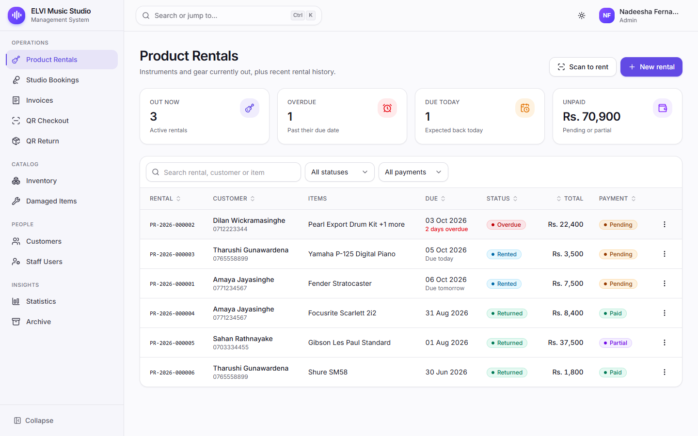
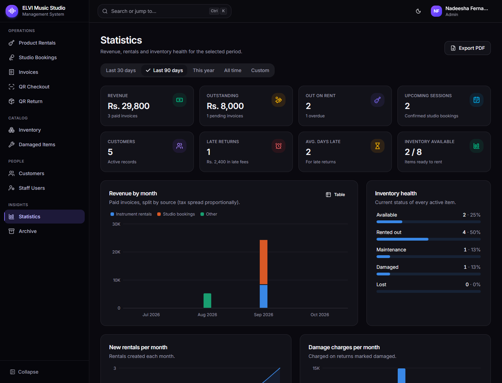
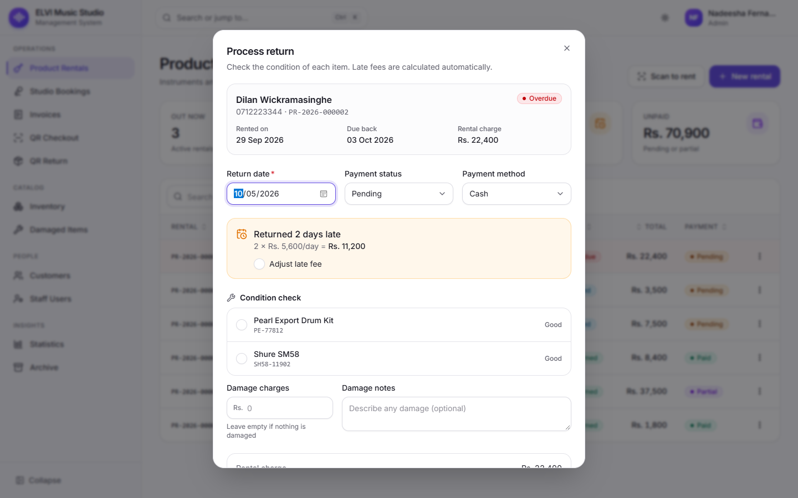
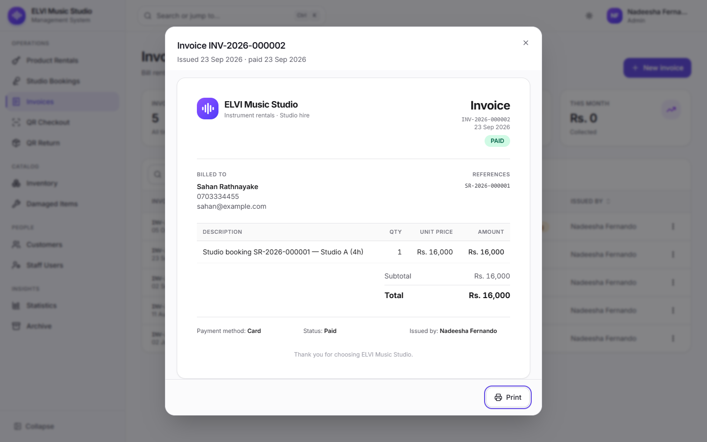
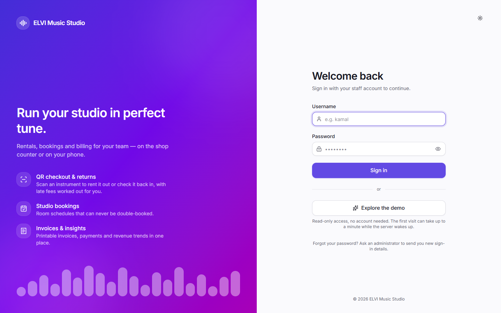
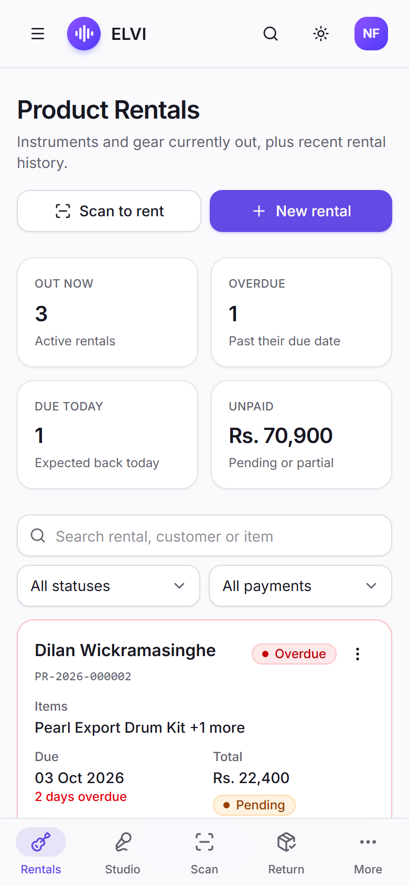
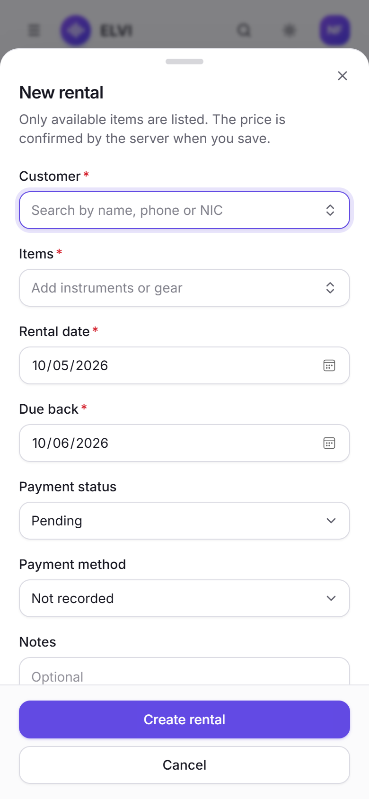
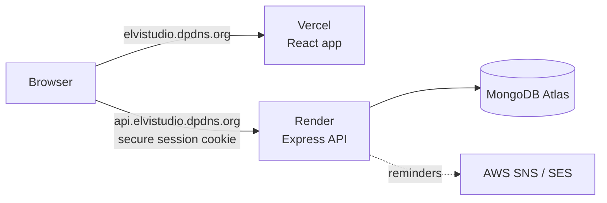

# ELVI Music Studio — Rental & Studio Management System

A full-stack web app for running a music studio: instrument rentals with QR checkout and returns, recording-room bookings, invoicing, customer records, staff accounts and business statistics. It works on phones, tablets and desktops, in light and dark themes.


## Live demo

**https://elvistudio.dpdns.org**

Click **Explore the demo** on the sign-in page, or sign in with:

| Username | Password | Access |
|---|---|---|
| `demo` | `Demo1234` | Read-only: open every page and form; changes aren't saved |

The demo runs on free hosting, so the first visit after a quiet period can take up to a minute while the server wakes up.

## Screenshots

| Rentals (desktop) | Statistics (dark mode) |
|---|---|
|  |  |
| **Return with automatic late fee** | **Printable invoice** |
|  |  |

| Sign in | Phone: rentals | Phone: new rental |
|---|---|---|
|  |  |  |

## Features

**Instrument rentals and returns**
- **QR checkout:** scan an instrument's label, or type its code, then pick the customer and dates. The rental and its invoice are created together.
- **Server-side pricing:** totals are calculated on the server from the daily rates. Extending a rental re-prices it.
- **QR returns:**
  - late fees calculated automatically
  - a condition check for each item; damaged items go to a repair queue
  - a printable return receipt
- **Overdue tracking and reminders:** overdue rentals are flagged automatically. SMS and email reminders go out the day before, on the day and the day after the due date, and are never sent twice.

**Studio bookings**
- Room scheduling that **cannot double-book**, even when two staff book at the same moment.
- Quick actions to mark sessions completed or cancelled.

**Invoicing**
- Link rentals and studio bookings, add extra lines and tax, and record the payment method.
- Marking an invoice paid also marks the linked rentals paid.
- Sequential numbers (`INV-2026-000123`) and printable invoices.

**Inventory and customers**
- QR labels generated in the browser, ready to download or print.
- Item statuses: available, rented, maintenance, damaged, lost.
- Customer profiles with rental history, total spend and unpaid fees.
- A customer blacklist, and an archive with restore.

**Statistics**
- Revenue by month and source, rental growth, damage costs, most-rented items, top customers and late returns.
- Date-range presets and PDF export.

**Staff and access**
- Roles:
  - **Admin:** everything.
  - **Cashier:** rentals, bookings, invoices and returns.
  - **Demo:** read-only.
- New staff must choose their own password at first sign-in. Admins can email sign-in details without ever seeing the password.

**Interface**
- Responsive layout:
  - desktop: a sidebar
  - tablet: a slide-out menu
  - phone: a bottom tab bar and forms that slide up from the bottom
- Light and dark themes, a **Ctrl/⌘ + K** command palette, and keyboard and screen-reader support.

## Tech stack

| Layer | Technologies |
|---|---|
| Frontend | React 19, TypeScript, Vite, Tailwind CSS v4, Radix UI (shadcn-style components), TanStack Query & Table, React Hook Form + Zod, Recharts, html5-qrcode, jsPDF |
| Backend | Node.js 24, Express 5, TypeScript, Mongoose 9, Zod, Pino (structured logs), node-cron, Helmet, express-rate-limit |
| Database | MongoDB Atlas (replica set, for multi-document transactions) |
| Notifications | AWS SNS (SMS) and SES (email) |
| Testing | Vitest, Supertest, mongodb-memory-server |
| Hosting | Vercel (website), Render (API), MongoDB Atlas (database), DigitalPlat (domain) |

## Architecture



The website and API are on sub-domains of the same domain, so the `httpOnly`, `SameSite=Strict` session cookie works without exposing the token to JavaScript.

## Security highlights

- **Sessions:** a JWT in an `httpOnly`, `Secure`, `SameSite=Strict` cookie. Sessions can be revoked instantly (sign-out, password or role change, deactivation).
- **CSRF protection:** a required request header, together with a strict CORS allowlist.
- **Input:** every request is validated with Zod, and MongoDB operator injection (`$ne`, `$gt`, …) is rejected.
- **Data integrity:** prices, late fees and invoice totals are calculated on the server, never taken from the browser. Concurrent rentals and bookings are made safe with database transactions.
- **Accounts:** login rate limiting and lockout, bcrypt password hashing, and a password policy.
- **Hardening:** Helmet security headers, and error messages that don't reveal internals.
- **Logging:** structured logs with request IDs, and personal data masked.

## Run it locally

Requires **Node.js 20+**.

**Option 1: no database needed.** Uses an in-memory MongoDB with sample data.
```bash
cd backend && npm install && npm run dev:demo      # API on http://localhost:5000
cd frontend && npm install && npm run dev          # App on http://localhost:5173
```
Sign in as:
- `admin` / `Demo1234`
- `cashier` / `Demo1234`
- `demo` / `Demo1234` (read-only)

Data resets whenever the API restarts, and no SMS or email is sent.

**Option 2: your own MongoDB Atlas database.**
1. Copy `backend/.env.example` to `backend/.env` and set:
   - `MONGO_URI` (include the database name, e.g. `…mongodb.net/elvi?…`)
   - `JWT_SECRET` (32+ random characters; generate one with `node -e "console.log(require('crypto').randomBytes(48).toString('base64'))"`)
2. Run `npm run seed` in `backend/` to create the first admin. It prints a temporary password.
3. Run `npm run dev` in both `backend/` and `frontend/`.

## Scripts

| Folder | Command | Purpose |
|---|---|---|
| backend | `npm run dev` | API with auto-reload |
| backend | `npm run dev:demo` | API with an in-memory database and sample data |
| backend | `npm test` | Integration tests |
| backend | `npm run build` / `npm start` | Production build / run |
| backend | `npm run seed` | Create the first admin account |
| backend | `npm run seed:sample` | Add the sample dataset and the read-only `demo` account (runs once; never changes existing data) |
| frontend | `npm run dev` / `npm run build` | Dev server / production build |
| frontend | `npm run lint` / `npm run typecheck` | Code checks |

## Project structure

```
backend/
  app.ts, server.ts      Express app / server start-up (DB, cron, graceful shutdown)
  config/                validated environment, DB connection, constants
  middleware/            auth & roles, validation, security, error handling
  routes/ → controllers/ → services/ → models/
  validators/            Zod request schemas
  utils/                 logger, transactions, document numbers, dates, AWS, cron jobs
  scripts/               seed.ts, demo.ts
  tests/                 API integration tests
frontend/src/
  api/                   data-fetching hooks per resource
  components/            UI kit, data table, layout (sidebar, tab bar, command palette)
  features/<area>/       pages and dialogs
docs/screenshots/        README images
render.yaml              Render deployment blueprint
frontend/vercel.json     Vercel routing and security headers
```

## Deployment

| Part | Where | Configuration |
|---|---|---|
| API (`backend/`) | Render web service, from `render.yaml` | `MONGO_URI`, `CORS_ORIGINS=https://elvistudio.dpdns.org`; `JWT_SECRET` is generated automatically |
| Website (`frontend/`) | Vercel, root directory `frontend` | `VITE_API_URL=https://api.elvistudio.dpdns.org/api`; optionally `VITE_DEMO_USERNAME` / `VITE_DEMO_PASSWORD` for the demo button |
| Database | MongoDB Atlas | Network Access allows Render's outbound IPs |
| DNS | DigitalPlat | `A @ → Vercel IP`, `CNAME api → elvi-api.onrender.com.` |

Pushing to `main` redeploys both the website and the API automatically. Health checks: `GET /healthz` (process up) and `GET /readyz` (database connected).

## Roadmap

- Server-side pagination and search for large lists
- A dashboard home with today's returns, overdue items and studio schedule
- A studio calendar view and hourly room rates
- An audit log of payment, fee and role changes
- Two-factor sign-in for admins
- Automated CI checks and browser end-to-end tests
- Payment links, WhatsApp reminders and an installable phone app

## Author

Built by [Pawan Laksahan](https://github.com/PawanLaksahanOfficial).
